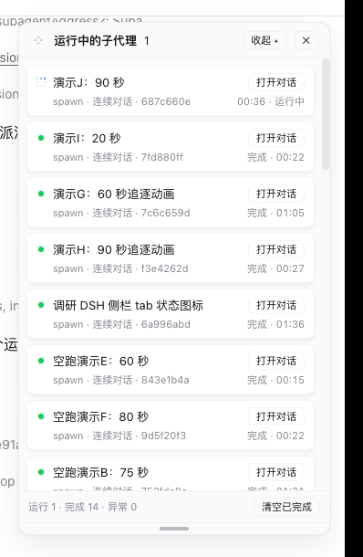

<h1 align="center">🤖 dsh-subagent-monitor</h1>

<p align="center">
  DeepSeek Harness (DSH) Web 扩展插件 · 子代理实时运行监视面板
  <br/>
  <a href="https://github.com/Mombrane/dsh-subagent-monitor/blob/master/LICENSE"></a>
  
  
</p>

**中文** | [English](README.en.md)

---

## ✨ 是什么

在 DSH Web 界面侧栏底部加一个「子代理」入口，并在屏幕**右上角**常驻一块卡片式面板，实时展示当前会话派生的每一个子代理的运行状态。

```
┌─ ⤢ 运行中的子代理 ──────────── [收起 ▴] [✕] ┐
│ ┌─────────────────────────────────────┐ │
│ │ 🔵 统计 ui 目录 TS 文件数   [打开对话] │ │
│ │    one-shot · 1a2b3c4d   运行中 · 00:42 │ │
│ └─────────────────────────────────────┘ │
│ ┌─────────────────────────────────────┐ │
│ │ 🟢 演示子代理：统计文件类型  [打开对话] │ │
│ │    spawn · 2b3c4d5e    完成 · 03:12  │ │
│ └─────────────────────────────────────┘ │
│  运行 1 · 完成 1 · 异常 0    [清空已完成] │
│ ════════════════════════════════════════ │ ← 拖动调整高度
└─────────────────────────────────────────┘
```

> 标题左侧 `⤢` 四角箭头拖动柄移动面板位置，底部 `═` 拖动柄调整面板高度；两者均记忆，双击复位。



## 🎯 特性

| 特性 | 说明 |
| --- | --- |
| 🟢 实时状态 | 运行中（🔵 蓝色像素追逐动画，与 DSH 侧栏状态点同款 + 秒表）、完成（绿点 + 光晕）、失败、已打断、令牌上限、已拒绝 |
| 🃏 卡片化列表 | 每个子代理一张圆角卡片；「打开对话」在右侧，状态与耗时在第二行 |
| 🌲 树形缩进 | 孙代子代理卡片向右缩进 |
| 🔙 一键返回 | 进入子代理会话后，面板出现「← 主会话」按钮 |
| 🖐 自由摆放 | 标题左侧四角箭头拖动柄移动面板，位置自动记忆（跨会话保留）；双击复位 |
| 📏 高度可调 | 底部拖动柄调整面板高度，高度按会话记忆；双击复位 |
| 🔄 刷新自恢复 | 常驻组合，页面刷新 / 服务重启后自动恢复 |
| 💤 自适应轮询 | 运行中或面板打开时 1 秒刷新；空闲 5 秒、隐藏标签页 15 秒，且不会并发叠加慢请求 |
| 📱 移动端友好 | ≤768px 视口默认不弹出，侧栏按钮仍可手动打开 |

## 📦 安装

### 方式 A · npm 安装（推荐，一行命令）

```bash
dsh plugin --profile <your-profile> add @leetoners/dsh-ui-subagent-monitor
```

> 本机验证版本为 `v0.2.1`；公共 npm 发布状态以仓库 release 为准。

### 方式 B · GitHub 直装

```bash
dsh plugin --profile <your-profile> add github:Mombrane/dsh-subagent-monitor
# 首次安装若提示允许构建脚本，按提示在 profile 的 pnpm-workspace.yaml 中确认即可
```

重启 `dsh web` 即生效。本仓库同时是 **DSH 客户端插件**（`dsh.client`）与 **组合 bundle**（`dsh.bundle` + `cordis.patch.yml`），并随附预构建 `lib/`。

### 方式 C · DSH 源码仓库内联（适合二次开发）

```bash
# 1. 复制本仓库 src/ 为 <dsh>/packages/client/ui-subagent-monitor/
# 2. <dsh>/packages/bundle/web-app/package.json 加依赖
"@leetoners/dsh-ui-subagent-monitor": "workspace:*"
```

```yaml
# 3. <dsh>/packages/bundle/web-app/cordis.patch.yml（ui-subagent 行之后）
- id: ui-subagent-monitor
  name: '@leetoners/dsh-ui-subagent-monitor'
```

```bash
# 4. 构建 + 重启
pnpm install && pnpm --filter @leetoners/dsh-ui-subagent-monitor bundle
# 重启 dsh web
```

> 还需在 `<dsh>/tsconfig.client.json` 的 `references` 中加入本包路径，并将本包
> `tsdown.config.ts` 改为引用主仓预设（`import { clientBundle } from '../tsdown.client.ts'`）。

## 🏷️ 状态图例

| 状态 | 含义 |
| --- | --- |
| 🔵 运行中 | 正在执行，蓝色像素追逐动画（与 DSH 侧栏 tab 进行态同款）+ 实时秒表 |
| 🟢 完成 | 面板实时见证其成功结束，显示耗时（绿点 + 光晕） |
| ⚪ 已结束 | 历史回填行：服务重启前创建，结局未观测（成功/失败未知） |
| 🔴 失败 | 错误结束（红点 + 光晕） |
| 🟠 已打断 / 令牌上限 / 已拒绝 | 被中止 / 达到 token 上限 / 请求被拒绝（琥珀点 + 光晕） |

## ❓ FAQ

**刷新页面会消失吗？** 不会。面板是组合中的常驻行，页面每次加载自动恢复。

**「完成」和「已结束」有什么区别？** 🟢 是面板实时观测到的成功结局；⚪ 是服务重启前的历史记录，结局未观测。

**面板有多大的容量？** 每个根会话最多保留 200 条，超出淘汰最旧的已结束行。

**面板位置和高度会记住吗？** 会，且两者记忆策略不同：**位置跨会话保留**（所有会话共用同一位置）；**高度按会话分别记忆**（localStorage 键带会话 ID，切换会话互不影响）；刷新页面 / 重启浏览器后恢复；双击拖动柄恢复默认。

**安全吗？** 轮询路由 `/api/subagent-monitor/snapshot` 面向回环地址、无鉴权，仅建议本地/内网使用。

## 🌐 生态收录

| 渠道 | 状态 |
| --- | --- |
| GitHub topics | `dsh-plugin`、`deepseek-harness`（Oh-My-DSH 每 4 小时自动同步） |
| Oh-My-DSH 插件目录 | PR [#8](https://github.com/like-study1/Oh-My-DSH/pull/8) 待维护者合并 |
| awesome-dsh-plugin | ✅ 已收录（commit `c7ad36e9`，PR [#675](https://github.com/awesome-dsh-plugin/awesome-dsh-plugin/pull/675) 已合并） |

## 📋 变更日志

完整变更历史见 [CHANGELOG.md](./CHANGELOG.md)。当前版本 **0.2.1**（与 `package.json` 对齐）。

## 📖 架构文档

设计决策（为什么常驻、为什么自建轮询路由、事件归因模型）与数据流细节见
[ARCHITECTURE.md](./ARCHITECTURE.md)。

## 📄 License

[MIT](./LICENSE) © Mombrane
